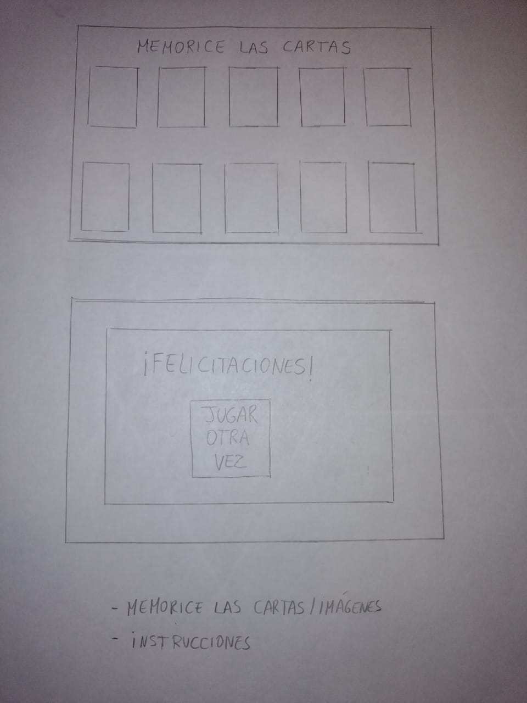
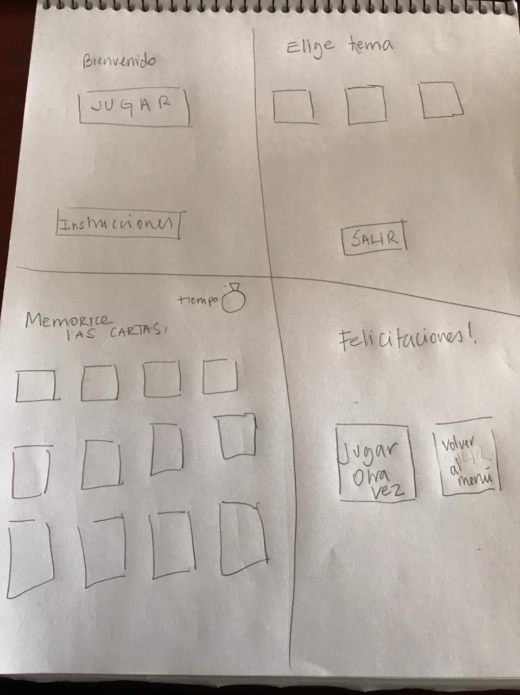
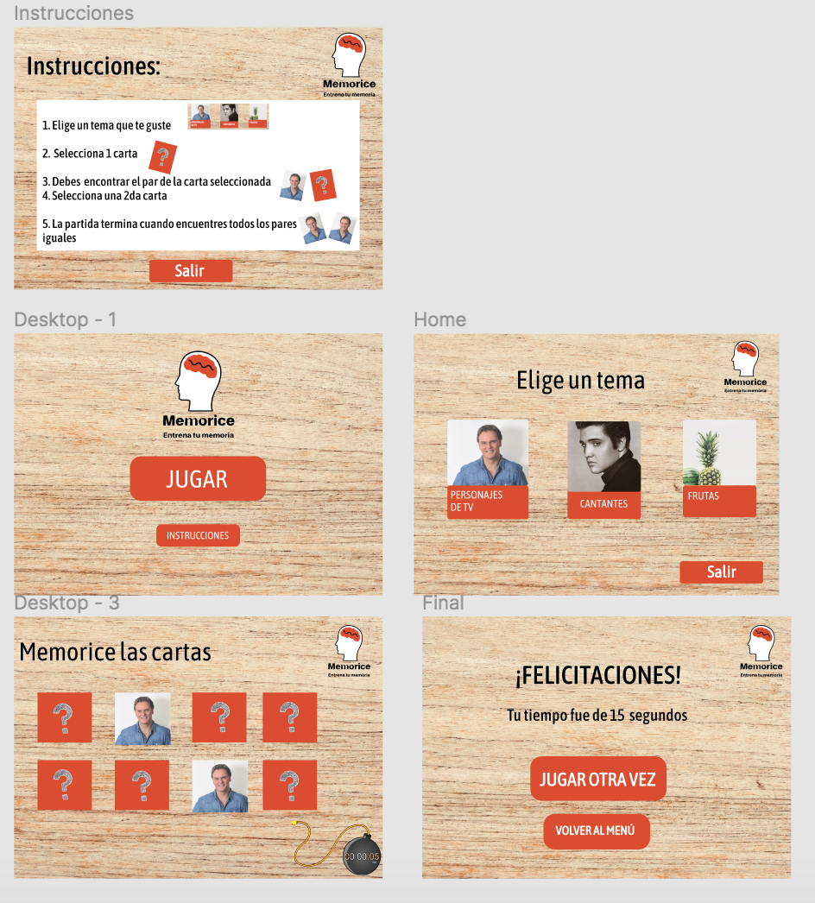

##### `README.md`

## Nombre del proyecto
"Memorice, entrena tu memoria"

## Resumen del proyecto
El proyecto es una aplicación web para escritorio, es un juego de memorice destinado a personas mayores.

## Principales usuarios y objetivos
Los principales usuarios son las personas mayores de 60 años en adelante. El principal objetivo es la estimulación objetiva a través del juego en sus tiempos de recreación.

## Imagen prototipo papel

  
  

* Resumen feedback
>Hay que agregar un botón "Salir".

>Que las fotos y letras sean grandes.

>Los botones "Nueva Partida" y "Salir" deben estar en una página diferente.

## Imagen prototipo final

## Resumen feedback prototipo final
>Estan bien los colores y el tamaño de los botones.

>Las letras estan bien de tamaño.

>Las fotos son nítidas.

